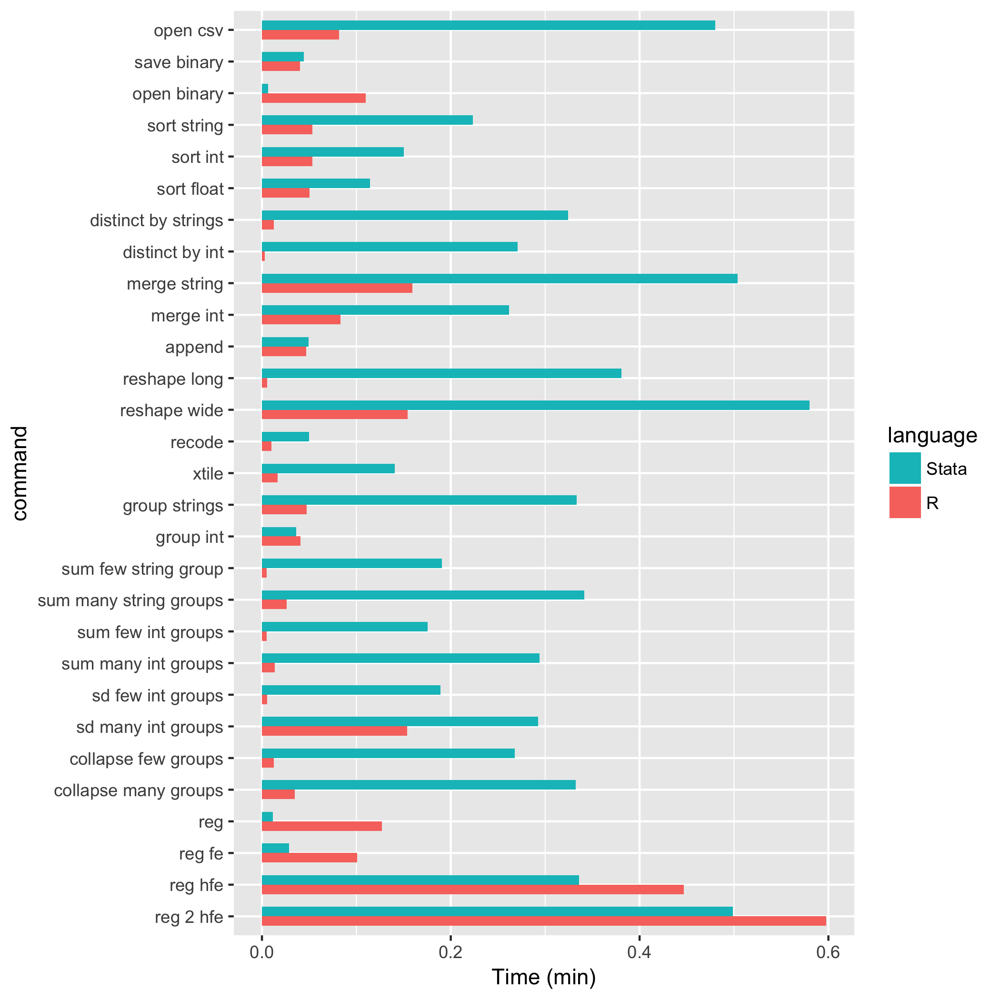

  
  
# Descripción del programa        


<br>

## ¿Que es R?

- Lenguaje para el procesamiento y análisis estadístico de datos

- Software Libre

- Sintaxis Básica: R base

- Sintaxis incremental[^1]: El lenguaje se va ampliando por aportes de Universidades, investigadores/as, usuarios/as y empresas privadas, organizados en librerías (o paquetes)

<br>


<br>

[^1]: Más allá de los comandos elementales, comandos más sofisticados tienen muchas versiones, y algunas quedan en desuso en el tiempo.


El _entorno_ más cómodo para utilizar el _lenguaje_ __R__ es el _programa_ __R studio__

- Rstudio es una empresa que produce productos asociados al lenguaje R, como el programa sobre el que corremos los comandos, y extensiones del lenguaje (librerías).
 
- El programa es _gratuito_ y se puede bajar de la [página oficial](https://www.rstudio.com/) 


## Diferencias con STATA y SPSS

- Gratuito
- Funciona principalmente por líneas de código (Aunque ya hay paquetes que permiten ejecutar comandos desde el menú y los botones sin tener que esribir código)
- Trabaja las bases de microdatos de forma virtual y no fisica, lo que permite disponer de varias al mismo tiempo sin mayor dificultad (no requiere abrir cada base, trabajarla por separado y luego cerrarla), ni exije guardar fisicamente los cambios.
- Más potente
    - Totalmente automatizable
    - Aportes de usuarias y usuarios
    - Extensible a otros lenguajes y usos (presentación como esta, diseño de aplicaciones)
- Más veloz:




<br>

# Lógica sintáctica en R base

Con _R base_ nos referimos a los comandos básicos que vienen incorporados en el R, sin necesidad de cargar librerías. 

## Objetos
Los __Objetos/Elementos__ constituyen la categoría escencial del R. De hecho, todo en R es un objeto, y se almacena con un nombre específico que **no debe poseer espacios**. Un número, un vector, una función, la progresión de letras del abecedario, una base de datos, un gráfico, constituyen para R objetos de distinto tipo. Los objetos que vamos creando a medida que trabajamos pueden visualizarse en la panel derecho superior de la pantalla ("Environment"). 


## Operadores

Los operadores son los símbolos que le indican a R que debe realizar una tarea. Mediante la combinación de datos y operadores es que logramos que R haga su trabajo.

Existen operadores específicos para cada tipo de tarea. Los tipos de operadores principales son los siguientes:

* De asignación
* Aritméticos
* Relacionales
* Lógicos


### Operadores de asignación

- $<-$
- $=$

Ambos operadores sirven para definir objetos, es decir, asignarle un valor. 
Sin embargo, en la práctica se suele utilizar el operador __```<-```__ para la definición de objetos, por más que el __```=```__ sea equivalente.  __A la izquierda__ del __```<-```__ debe ubicarse el nombre que tomará el elemento a crear. __Del lado derecho__ debe ir la definición del mismo.

Veamos un ejemplo:
```{r echo=TRUE}
A <- 1
A 
```

Al definir un elemento, el mismo queda guardado en el ambiente del programa, y podrá ser utilizado posteriormente para observar su contenido o para realizar una operación con el mismo.

```{r echo=TRUE}
A + 6
```

Al correr una linea con el nombre del objeto, la consola del programa nos muestra su contenido. Entre corchetes observamos el número de orden del elemento en cuestión.


```{r echo=TRUE}
B <- 2
B
```

__```<-```__ es un operador __Unidireccional__, es decir que:     
```A <- B``` implica que __A__ va tomar como valor el contenido del objeto __B__, y no al revés.

```{r echo=TRUE}
A <- B

#Ahora A toma el valor de B, y B continua conservando el mismo valor
A   
B
```

En R, cuando se define un objeto con el mismo nombre de un objeto previamente existente, el último reemplaza al primero.


### Operadores aritméticos:

- Suma: $+$
- Resta: $-$
- Cociente: $/$
- Multiplicación: $*$

```{r echo=TRUE}
#suma
A <- 5+6
A
#Resta
B <- 6-8
B
#cociente
C <- 6/2
C
#multiplicacion
D <- 6*2
D
```

### Operadores lógicos relacionales: 

Los operadores lógicos son usados para describir relaciones, expresadas como verdadero (TRUE) o falso (FALSE).

- Mayor: $>$
- Mayor o igual: $>=$
- Menor: $<$
- Menor o igual: $<=$
- Igual: $==$
- Distinto: $!=$


```{r echo=TRUE}
#Redefinimos los valores A y B
A <- 10
B <- 20

#Realizamos comparaciones lógicas
A > B
A >= B
A < B
A <= B
A == B
A != B

C <- A != B
C
```

Como muestra el último ejemplo, el resultado de una operación lógica puede almacenarse como el valor de un objeto.


### Otros operadores lógicos: 

- Ó: $|$
- Y: $&$

```{r echo=TRUE}
#Redefinimos los valores A y B
A <- 10
B <- 20
#Realizamos comparaciones lógicas

(A | B) > 30
(A & B) <= 30
```


## Caracteres especiales

- R es sensible a mayúsculas y minúsculas, tanto para los nombres de las variables, como para las funciones y parámetros.
- Los __espacios en blanco__ y los __carriage return__ (_enter_) no son considerados por el lenguaje. Los podemos aprovechar para emprolijar el código y que la lectura sea más simple[^2].

[^2]: veremos que existen ciertas excepciones con algunos paquetes más adelante. 

- El __numeral__ ```#``` se utiliza para hacer comentarios. Todo lo que se escribe después del # no es interpretado por R. Se debe utilizar un # por cada línea de código que se desea anular

- Los __corchetes__ ```[]``` se utilizan para acceder a un objeto:
    - en un vector[n° orden]
    - en una tabla[fila, columna]
    - en una lista[n° elemento]
- el signo __$__ también es un método de acceso. Particularmente, en los dataframes, nos permitira acceder a una determinada columna de una tabla

- Los __paréntesis__```()``` se utilizan en las funciones para definir los parámetros.

- Las __comas__ ```, ```  se utilizan para separar los parametros al interior de una función. 

***

## Tipos de Objetos:    
Existen un gran cantidad de objetos distintos en R, en lo que respecta al curso trabajaremos principalmente con 4 de ellos:

- Valores
- Vectores
- Data Frames
- Listas

### Valores
Los valores pueden ser de distintas _clases_:   
__Valores "Numeric" (numéricos)__
```{r echo=TRUE}
A <- 1
class(A)
```

<br>
  
__Valores 'Character' (caracter)__
```{r echo=TRUE}
A <- "Hola"
class(A)

A <- "Hola, ¿qué tal?"
class(A)

A <- paste('Hola,', '¿qué tal?', sep = " ")
A
class(A)
```

<br>
  
__Valores de tipo 'factor'__
  
En general, es un dato numérico representado por una etiqueta.

```{r echo=TRUE}
valor1 <- "A"
class(valor1)

valor2 <- factor("A")
valor2

# Otra forma de definir al factor
valor2 <- factor(valor1)
valor2
class(valor2)

# Una propiedad del factor: las etiquetas.
valor3 <- factor("A",
                 labels = "Letra A")
class(valor3)
valor3

```

<br>
  
La diferencia entre un _character_ y un _factor_ es que el último tiene solo algunos valores permitidos (levels), con un orden interno predefinido (el cual ,por ejemplo, se respetará a la hora de realizar un gráfico)  


### Vectores
Un vector es un conjunto de datos de un mismo tipo. En otras palabras, es un conjunto de valores de la misma clase. Puede haber vectores númericos, character, factores.
Los vectores constituyen la estructura de datos más sencilla de R.

Para crear un __vector__ utilizamos el comando ```c()```, de combinar.
```{r echo=TRUE}
# Vector numérico
A <- c(1, 2, 2, 2, 1, 1, 1)
A
class(A)

# Vector de caracteres
B <- c("Uno", "Dos", "Dos", "Dos", "Uno", "Uno", "Uno")
B
class(B)

# Vector de tipo factor
C <- as.factor(A)
C
class(C)

# Defino etiquetas del vector numérico o caracter
A
A_etiquetas <- factor(A,
                     labels = c('Varón','Mujer'))
A_etiquetas
```

Con los vectores numéricos se pueden hacer operaciones como, por ejemplo:
* sumarle 2 a cada elemento del __vector__ anterior.
```{r echo=TRUE}
D <- c(1, 3, 4)
D <- D + 2
D
```

* sumarle 1 al primer elemento, 2 al segundo, y 3 al tercer elemento del __vector__ anterior
```{r echo=TRUE}
E <- D + 1:3 #esto es equivalente a hacer 3+1, 5+2, 6+9 
E
```
```1:3``` significa que queremos todos los números enteros desde 1 hasta 3. 

<br>

En R podemos quedarnos con algunos elemenos de los vectores para trabajar con o sobre ellos.
Para acceder a un elemento del vector podemos buscarlo a través del número de orden, identificando al mismo utilizando los signos ```[ ]```

```{r echo=TRUE}
# Si quiero al elemento 2 del objeto E:
E 
E[2]
```

Si nos interesa quedarnos con dicho valor, al buscarlo lo asignamos a un nuevo objeto.
```{r echo=TRUE}
E_posicion2 <-  E[2]
E_posicion2
```

Para __borrar__ un objeto del ambiente de trabajo, utilizamos la función _```rm()```_
```{r error=TRUE}
rm(E_posicion2)
E_posicion2
```

También podemos cambiar el texto del segundo elemento de E, por el texto "Pablo"
```{r echo=TRUE}
E
E[2] <- "Pablo"
E

# Tener cuidado al modificar el tipo de uno de los valores y no el de todos los del objeto:
class(E)
```

### Data Frames
Un Data Frame es una estructura de datos de 2 dimensiones o tabla, donde cada columna representa una variable, y cada fila una observación. 
Los data frames pueden contener datos de diferentes clases. 
Puede ser considerado como un conjunto de vectores de igual tamaño, donde cada vector (columna) tiene que tener datos del mismo tipo, pero las clases de vectores que conforman la tabla pueden ser distintas. Entonces, cada observación (fila) está compuesta por datos que pueden ser de distinto tipo.

Este objeto es central en el proceso de trabajo, ya que es la estructura más usada para realizar análisis de datos, y suele ser la forma en que se cargan datos externos para trabajar en el ambiente de R, y en que se exportan los resultados de nuestros trabajo.  

Veamos un ejemplo de data frame creado a partir de la combinación de vectores:
```{r echo=TRUE}
AGLOMERADO  <- c(32,33,33,33,32)

SEXO  <-  c("Varon","Mujer","Mujer","Varon","Mujer")

EDAD  <-  c(60,54,18,27,32)

Datos <- data.frame(AGLOMERADO, SEXO, EDAD)
Datos
class(Datos)
```

Tal como en un __vector__ podemos acceder a los elementos a través de los ```[ ]```, en un __dataframe__ lo hacemos de la forma __```[fila, columna]```__.

En los Data.Frames tenemos, por definición, más de una columna (variable). Para acceder a alguna de ellas podemos utilizar el operador __```$```__.
```{r}
Datos[3,2]
Datos[4,3]

Datos$AGLOMERADO
class(Datos$AGLOMERADO)

Datos$AGLOMERADO[2]
```

¿que pasa si hacemos ```Datos$AGLOMERADO[3,2]``` ?
```{r error=TRUE}
Datos$AGLOMERADO[3,2]
```

Nótese que el último comando tiene un número incorrecto de dimensiones, porque estamos refiriendonos 2 veces a la columna AGLOMERADO.    

Acorde a lo visto anteriormente, el acceso a los __dataframes__ mediante  ```[ ]``` puede utilizarse también para realizar filtros (devolver el o los valores en función de otro valor definido). 
Por ejemplo, puedo utilizar los  ```[ ]``` para obtener del __dataframe__ ```Datos ```  unicamente los registros del AGLOMERADO 32:
```{r error=TRUE}
Datos[Datos$AGLOMERADO==32, ]
```

La lógica del paso anterior sería: Accedo al dataframe ```Datos```, pidiendo únicamente conservar las filas (por eso la condición se ubica a la _izquierda_ de la  ```, ```) que cumplan el requisito de pertenecer a la categoría __32__ de la variable __AGLOMERADO__.      

Aún más, podría aplicar el filtro y al mismo tiempo identificar una variable de interés para luego realizar un cálculo sobre aquella. Por ejemplo, podría calcular la media de la edad para aquellas personas que residen en el aglomerado 32.
```{r error=TRUE}
###Por separado
Edad_Aglo32 <- Datos$EDAD[Datos$AGLOMERADO==32]
Edad_Aglo32
```

```{r error=TRUE}
mean(Edad_Miembro1)

# Otra forma de lograr el mismo resultado
Edad_Aglo32 <- mean(Datos$EDAD[Datos$AGLOMERADO==32])
```

La lógica de esta sintaxis sería: "Me quedó con la variable __EDAD__, cuando la variable AGLOMERADO sea igual a __32__, luego calculo la media de dichos valores"

<br>

### Listas

Contienen una concatenación de objetos de cualquier tipo. Así como un vector contiene valores, un dataframe contiene vectores, una lista puede contener dataframes, pero también vectores, o valores, y _todo ello a la vez_
```{r}
LISTA <- list(A,B,C,D,E,Datos$AGLOMERADO, DF = Datos)
LISTA
```

Tal como para con los Vectores y los Data.Frames, podemos acceder a un elemento de una lista, utilizando el operador __```$```__:
```{r}
LISTA$DF
LISTA$DF$EDAD
LISTA$DF$EDAD[2]
```

También se pueden usar corchetes dobles __```[[]]```__ para acceder a los distintos elementos de una lista.
```{r}
LISTA[[6]]
```

O para acceder a un valor/vector (dependiendo del tipo de elemento de la lista) de un objeto de la lista:
```{r}
LISTA[[6]][1]

LISTA[[7]][2]

LISTA[[7]][2,1]
```

## Funciones (las herramientas del armario):
Las funciones son series de procedimientos estandarizados, que toman como imput determinados argumentos a fijar por el usuario (llamados parámetros), y devuelven un resultado acorde a la aplicación de dichos procedimientos. Su lógica de funcionamiento es:   
```funcion(argumento1 = arg1, argumento2 = arg2)```      

A lo largo del curso iremos viendo numerosas funciones, según lo requieran los distintos ejercicios. Sin embargo, veamos ahora algunos ejemplos para comprender su funcionamiento:    

- paste() : concatena una serie de caracteres, indicando por última instancia como separar a cada uno de ellos        
- paste0(): concatena una serie de caracteres sin separar
- sum(): suma de todos los elementos de un vector   
- mean() promedio aritmético de todos los elementos de un vector   
```{r}
paste("Pega","estas", 4, "palabras", sep = " ")

#Puedo concatenar caracteres almacenados en objetos
a <- c(1, 2, 3)
b <- "con"
c <- c(4, 5, 6)

paste(a,b,c,sep = "-")

# Paste0 pega los caracteres sin separador
paste0(a,b,c)

# ¿Te acordás del comando que usamos?
1:5

# Función para sumar
sum(1:5)

# Para calclar medias
mean(1:5)
```

# Instalación de paquetes complementarios al R Base (¡más cajas de herramientas para el armarrio!)

Hasta aquí hemos visto múltiples funciones que están contenidas dentro del lenguaje básico de R. Ahora bien, al tratarse de un software libre, distintos usuarios de R contribuyen sistemáticamente a expandir este lenguaje mediante la creación y actualización de __paquetes__ complementarios. Lógicamente, los mismos no están incluidos en la instalación inicial del programa, pero podemos descargarlos e instalarlos con el siguiente comando:   
``` 
install.packages("nombre_del_paquete") 
```
Al ejecutar el comando se descargarán de la pagina de [CRAN](www.cran.r-project.org) los archivos correspondientes al paquete hacia el directorio en donde hayamos instalado el programa. Típicamente los archivos se encontrarán en **C:\Program Files\R\R-3.5.0\library\**, siempre con la versión del programa correspondiente.              

Los paquetes sólo se instalan una vez en la computadora (si cambias de computadora, tenés que volver a instalarlo). Una vez instalado el paquete, cada vez que abramos una nueva sesión de R y querramos utilizar el mismo debemos **cargarlo al ambiente de trabajo** mediante la siguiente función:
``` 
library(nombre_del_paquete)
```
Nótese que al cargar/activar el paquete no son necesarias las comillas.

# Lectura y escritura de archivos

## .csv  y  .txt

Hay __muchas__ funciones para leer archivos de tipo _.txt_ y _.csv_ (esto es, además de las que trae R base, se han creado paquetes para importar distintos tipos de archivos). La mayoría sólo cambia los parámetros que vienen por default.

Es importante tener en cuenta que una base de datos que proviene de archivos _.txt_, o _.csv_ puede presentar diferencias en cuanto a los siguientes parametros:

- encabezado
- delimitador (```,```, tab, ```;```)
- separador decimal 

Un ejemplo de cómo importar un archivo de tipo _delimitado por comas_
``` 
dataframe <- read.delim(file, header = TRUE, sep = "\t", quote = "\"", dec = ".", fill = TRUE, comment.char = "", ...) 
```

Vamos con un ejemplo. Tenemos que levantar la base individual de EPH del 1er trimestre 2017

En el parametro `file` tengo que especificar el nombre completo del archivo, incluyendo el directorio donde se encuentra. Lo más sencillo es abrir comillas, apretar `Tab` y se despliega el menú de las cosas que tenemos en el directorio de trabajo. Si queremos movernos hacia arriba, agregamos `../`
```{r echo=TRUE, message=FALSE, warning=FALSE}
individual_t117 <- read.table(file = 'Fuentes/usu_individual_t117.txt',
                              sep=";", 
                              dec=",", 
                              header = TRUE, 
                              fill = TRUE)
individual_t117
```
  
Como puede observarse desde el ambiente (environment), la base de la EPH cuentan con más de 58.000 registros y 177 variables.
Al trabajar con bases de microdatos, resulta conveniente contar con algunos comandos para tener una mirada rápida de la base, antes de comenzar a realizar los procesamientos que deseemos.     

Veamos algunos de ellos:
```{r}

View(individual_t117) # Abre la base en una ventana aparte
names(individual_t117) # Devuelve el nombre de todas las variables
summary(individual_t117)[ ,c(8,10,31,133)] # Devuelve algunas medidas de resúmen para todos los casos de las columnas enumeradas
head(individual_t117)[ ,1:5] # Devuelve sólo los primeros valores para las columnas seleccionadas

# Notar que seguimos utilizando funciones de R base ya que no necesitamos cargar ningún 'paquete' para utilizarlos
```

## Excel 

Para leer y escribir archivos excel debemos utilizar los comandos que vienen con la librería ´´´openxlsx´´´
```{r, warning=FALSE}
install.packages("openxlsx") # por única vez

# Activamos la librería para poder usar sus funciones
library(openxlsx) 

# Creamos una tabla cualquiera de prueba
x <- 1:10
y <- 11:20
tabla_de_R <- data.frame(x, y)
tabla_de_R

# Escribimos el archivo
write.xlsx( x = tabla_de_R, file = "archivo_tabla.xlsx",
            row.names = FALSE)
```

Dónde lo guardó? Si trabajamos con un proyecto, R establece un directorio por default que es aquella carpeta donde hayamos creado el proyecto. Podemos entrar a las sub-carpetas agregando niveles con las ´´´__/__´´´ y al final escribiendo el nombre del archivo con su extensión (´´´archivo_tabla.xlsx´´´)

Con la función ´´´getwd()´´´ podemos visualizar la ruta que el programa tiene seteada:
```{r}
getwd()
```

# Ambientes de trabajo

Hay algunas cosas que tenemos que tener en cuenta respecto del orden del ambiente en el que trabajamos:
  
- __Working Directory__: El directorio de trabajo, pueden ver el suyo con `getwd()`, es *hacia donde apunta el código*, por ejemplo, si quieren leer un archivo, la ruta del archivo tiene que estar explicitada como el recorrido desde el Working Directory.
  
- __Environment__: Esto engloba tanto la información que tenemos cargada en *Data* y *Values*, como las librerías que hemos "convocado" para trabajar. 
  
- Es importante que mantengamos bien delimitadas estas cosas entre diferentes trabajos, sino:

1. El directorio queda referido a un lugar específico en nuestra computadora. 
  - Si se lo compartimos a otro **se rompe**
  - Si cambiamos de computadora **se rompe**
  - Si lo cambiamos de lugar **se rompe**
  - Si primero abrimos otro script **se rompe**
2. Tenemos mezclados resultados de diferentes trabajos:
  - Nunca sabemos si esa variable/tabla/lista se creo en ese script y no otro
  - Perdemos espacio de la memoria
  - No estamos seguros de que el script cargue todas las librerías que necesita

Rstudio tiene una herramienta muy útil de trabajo que son los **proyectos**. Estos permiten mantener un ambiente de trabajo delimitado por cada uno de nuestros trabajos. Es decir:

- El directorio de trabajo se refiere a donde esta ubicado el archivo .Rproj
- El Environment es específico de nuestro proyecto.

Un proyecto no es un sólo script, sino toda una carpeta de trabajo. 


Para crearlo, vamos al logo de nuevo projecto (Arriba a la izquierda de la panatalla), y elegimos la carpeta de trabajo. 


# Paquetes a utilizar a lo largo del curso:

Para quienes esten trabajando con sus computadoras personales, dejamos a continuación un listado de los paquetes complementarios del R base que utilizaremos a lo largo del curso. Como la instalación requiere descargar múltiples archivos de internet recomendamos hacerlo cuando dispongan de una buena conexión. Con el siguiente comando podrían instalarlos todos de una vez:       
```
install.packages(c("tidyverse","openxlsx",'ggplot2','ggthemes', 'ggrepel','ggalt','kableExtra'))
```
  
  