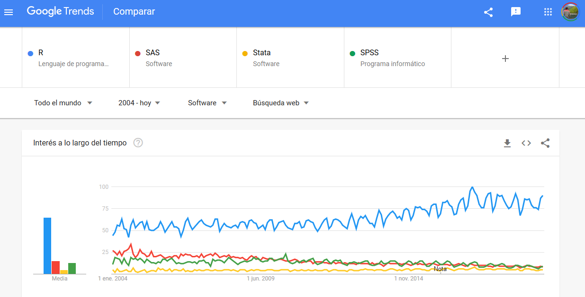
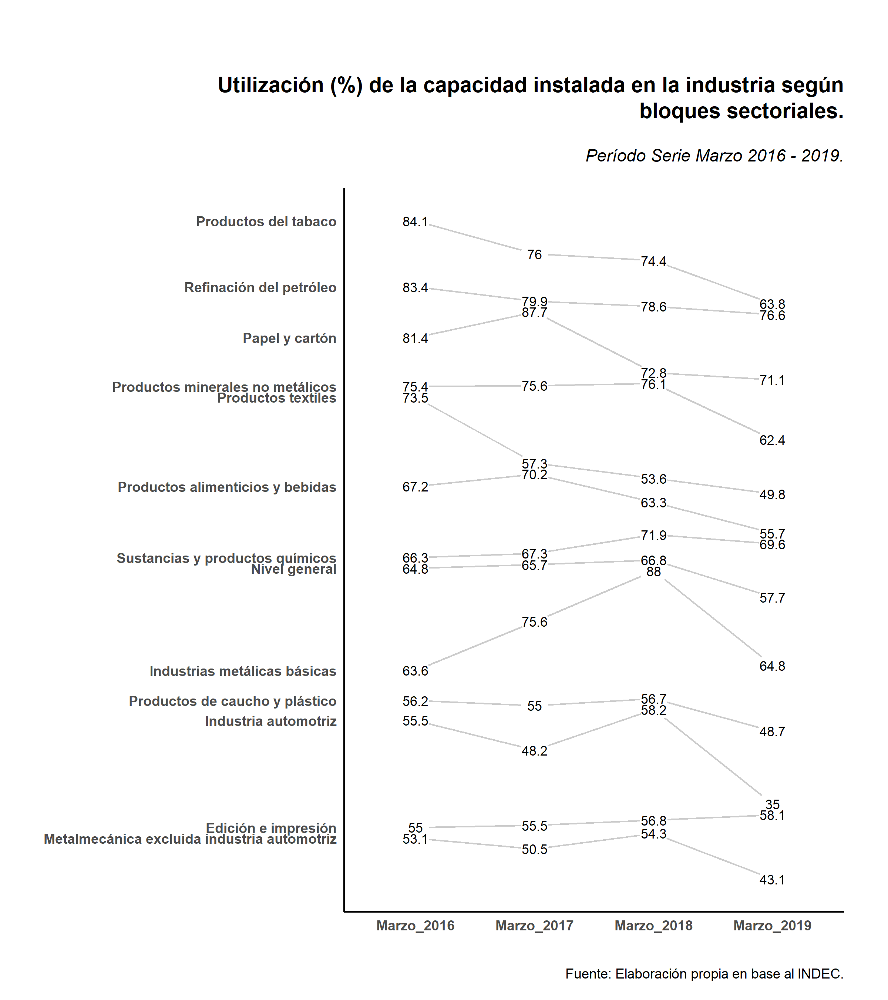

```{r xaringan-themer, include = FALSE}
#devtools::install_github("gadenbuie/xaringanthemer")
library(xaringanthemer)
duo_accent(primary_color = "#006747", secondary_color = "#CFC493")
```

class: middle, center

# ¿Qué es [R](https://cran.r-project.org/)?

---
class: middle, center, inverse

background-image: url(img/r_miedo.jpg)
background-size: contain

---
class: inverse, center

# R es...
 
Libre (con licencia no paga)

```{r echo=FALSE, out.width = '80%', fig.align = 'center'}
knitr::include_graphics("img/softwarelibre.png") 
```

---
class: inverse, center

# R es...

Abierto

```{r echo=FALSE, out.width = '80%', fig.align = 'center'}

```

---
class: inverse

# R es...
<br>

- Un lenguaje para el procesamiento y análisis de datos
  
<br>
  
- El lenguaje troncal es conocido como "R base"
  
<br>
  
- Sobre esa base se desarrollan un conjunto de funciones y paquetes que incluso pueden cambiar ciertas formas de programar el mismo lenguaje
  
  
---
class: middle, center, inverse

background-image: url(img/R1.PNG)
background-size: contain

---

class: middle, center, inverse

background-image: url(img/R2.PNG)
background-size: contain

---
class: middle, center, inverse

background-image: url(img/R3.PNG)
background-size: contain

---
class: middle, center, inverse

background-image: url(img/R4.PNG)
background-size: contain

---
class: middle, center, inverse

background-image: url(img/R5.PNG)
background-size: contain
  
---

class: middle, center

# ¿Por qué R?

---
class: inverse

## ¿Por qué R?

<br><br>

- Permite sistematizar tareas repetitivas

<br>

--

- Permite crear funciones a medida

<br>

--

- Garantiza la reproductibilidad y la estandarización de procesos

<br>

--

- Destina más memoria al funcionamiento que a la plataforma (vs SPSS o SAS, por ejemplo)

<br>

---
class: inverse

## ¿Por qué R?

- Su comunidad potencia la capacidad de consulta y respuesta


```{r echo=FALSE, out.width = '70%', fig.align = 'center'}
knitr::include_graphics("img/r_ayuda.png")
```

---
class: inverse

## ¿Por qué R?

- Consultas sobre los programas estadísticos en Google
  
```{r echo=FALSE, out.width = '100%', fig.align = 'center'}
 
```

---
class: inverse

## ¿Por qué R?

- Sus gráficos son flexibles y con calidad de publicación

```{r echo=FALSE, out.width = '90%', fig.align = 'center'}
knitr::include_graphics("img/grafico_ingresos.jpg")
```

---
class: inverse

## ¿Por qué R?

```{r echo=FALSE, out.width = '60%', fig.align = 'center'}

```

---
class: inverse

## ¿Por qué R?
  
- Para el año 2019 se publicaron más de 16.000 paquetes "oficiales" en CRAN

```{r echo=FALSE, out.width = '110%', fig.align = 'center'}
knitr::include_graphics("https://gist.githubusercontent.com/daroczig/3cf06d6db4be2bbe3368/raw/b66b0531fb1b86d3e04a003b2e105ad4f147900e/number-of-submitted-packages-to-CRAN.png") 
```
  fuente: [Gergely Daróczi](https://blog.revolutionanalytics.com/2017/01/cran-10000.html)


---

class: inverse

## R vs otros programas de licencia paga

- R Es gratuito (todas sus versiones, todas sus herramientas, todo el tiempo)

--

- Nada de "crackear" el programa, buscarlo en la web (¿¡Eso es un virus!?) o esperar a ese pendrive salvador con el instalador

--
  
- Con R se generó una comunidad dedicada a facilitar el acceso al lenguaje y, también, a su desarrollo (los "mortales" podemos crear herramientas en función de los problemas con los que nos enfrentamos).

--
  
- Es más fácil ayudar y que te ayuden (foros, comunidades, tutoriales)

--
  
- Potencia: 
    * no trabaja sobre objetos físicos
    * Totalmente automatizable
    * Interactua con otros lenguajes

--
  
- R te demanda mayor conocimiento sobre tus datos, tus procesos y también sobre estadística.

---
class: middle, center

# Manos a la obra

---
class: inverse, middle

## Rstudio

<br>

- Es el entorno más popular para trabajar con el lenguaje R.

<br>

- Es una empresa que no cobra por el uso del programa, sí por el soporte.

<br>

- Es también un traductor de R a diferentes lenguajes, lo que permite trabajar el dato, visualizar los resultados y generar reportes en diferentes formatos de salida (.doc, .xlsx., .pdf, presentaciones, dashboards, entre otros.), todo desde la misma plataforma

---
class: inverse, center, middle

.pull-left[

## R:

<br>

```{r echo=FALSE, out.width = '100%', fig.align = 'center'}

```
]

.pull-right[

## RStudio:

<br>

```{r echo=FALSE, out.width = '100%', fig.align = 'center'}
knitr::include_graphics("img/r_panel_rstudio.jpg")
```
]

