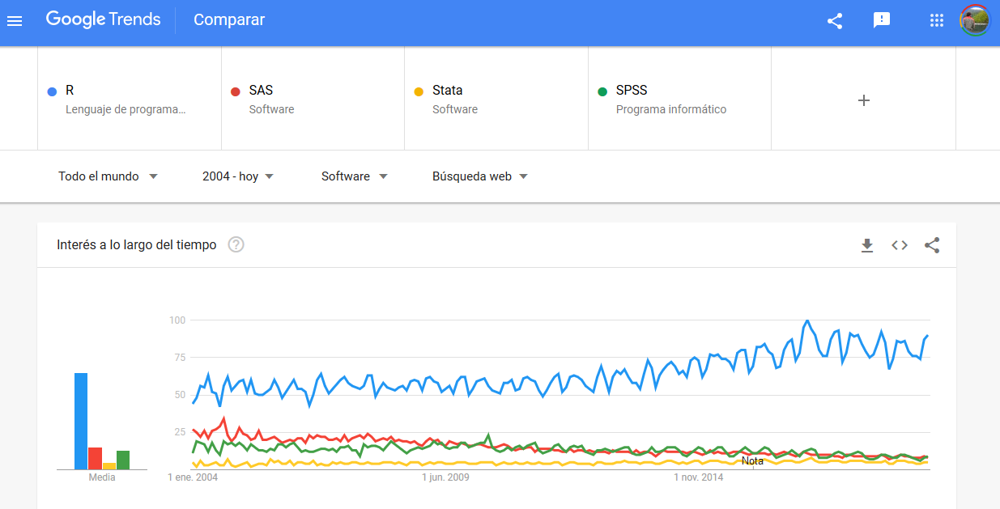
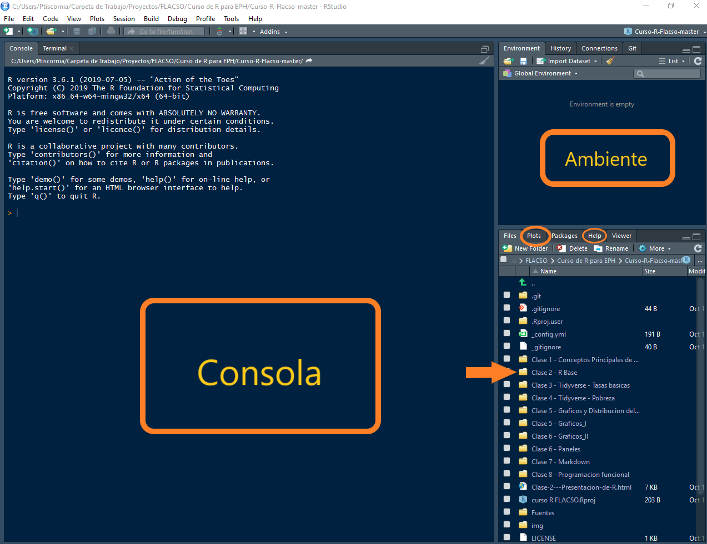
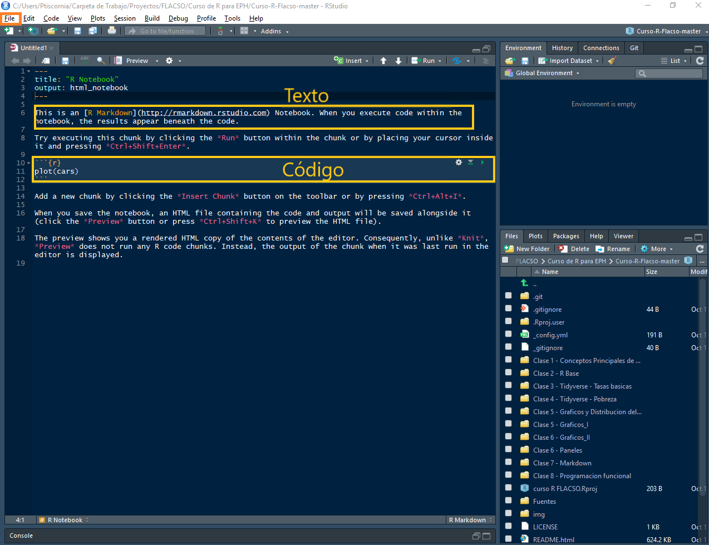

```{r xaringan-themer, include = FALSE}
#devtools::install_github("gadenbuie/xaringanthemer")
library(xaringanthemer)
duo_accent(primary_color = "#006747", secondary_color = "#CFC493")
```

class: middle, center

# ¿Qué es [R](https://cran.r-project.org/)?

---
class: middle, center, inverse

background-image: url(https://raw.githubusercontent.com/Guidowe/Curso-R-Flacso/master/Clase%202%20-%20R%20Base/r_miedo.jpg)
background-size: contain

---
class: inverse

# R es...

<br><br><br><br>
  
- Un software libre y abierto
  
- Un lenguaje para el procesamiento y análisis de datos
  
- Su sintáxis básica es conocida como "R base"
  
- Sobre esa base se desarrollan un conjunto de funciones y paquetes que incluso pueden cambiar ciertas formas de programar el código
  
---
class: middle, center, inverse

background-image: url(img/R1.PNG)
background-size: contain

---

class: middle, center, inverse

background-image: url(img/R2.PNG)
background-size: contain

---
class: middle, center, inverse

background-image: url(img/R3.PNG)
background-size: contain

---
class: middle, center, inverse

background-image: url(img/R4.PNG)
background-size: contain

---
class: middle, center, inverse

background-image: url(img/R5.PNG)
background-size: contain
  
---

class: middle, center

# ¿Por qué R?

---
class: inverse

## ¿Por qué R?


- Con el ambiente de trabajo RStudio se pueden tratar los datos, visualizar los resultados, analizarlos y presentarlos

- Su comunidad potencia la capacidad de consulta y respuesta

```{r echo=FALSE, out.width = '60%', fig.align = 'center'}
knitr::include_graphics("img/r_ayuda.png")
```

---
class: inverse

## ¿Por qué R?

- Sus gráficos son flexibles y con calidad de publicación

.pull-left[
]

.pull-right[
]


---
class: inverse

## ¿Por qué R?
  
- Su potencia aumenta significativamente a medida que usuarixs, investigadorxs, institutos, organizaciones y empresas privadas "crean" y, sobre todo, publican funciones específicas para problemas particulares.
  
- Para el año 2019 se publicaron más de 16.000 paquetes "oficiales" en CRAN

```{r echo=FALSE, out.width = '80%', fig.align = 'center'}
knitr::include_graphics("https://gist.githubusercontent.com/daroczig/3cf06d6db4be2bbe3368/raw/b66b0531fb1b86d3e04a003b2e105ad4f147900e/number-of-submitted-packages-to-CRAN.png") 
```
  fuente: [Gergely Daróczi](https://blog.revolutionanalytics.com/2017/01/cran-10000.html)

---
class: inverse

## ¿Por qué R?


- Consultas sobre los programas estadísticos en Google
  
```{r echo=FALSE, out.width = '100%', fig.align = 'center'}
 
```


---

class: inverse

## R vs SPSS / STATA / SAS

- R Es gratuito 

--

- Nada de "crackear" el programa, buscarlo en la web (¿¡Eso es un virus!?) o esperar a ese pendrive salvador con el instalador

--
  
- En STATA/ SPSS / SAS trabajas con lo disponible, en R podés crear herramientas en función de los problemas con los que te enfrentas

--
  
- Es más fácil ayudar y que te ayuden (foros, comunidades, tutoriales)

--
  
- Potencia: 
    * Trabaja virtualmente
    * Totalmente automatizable
    * Interactua con otros lenguajes

--
  
- R te obliga a conocer más sobre tus datos, tus procesos y sobre estadística.

---
class: middle, center

# ¡Manos a la obra!

---
class: inverse, middle

  * Abramos el archivo _"curso R FLACSO"_, lo podemos identificar por el siguiente ícono 


```{r echo=FALSE, out.width = '80%', fig.align = 'center'}
knitr::include_graphics("img/abrir_proyecto.png")
```

---
class: inverse, middle

- Rstudio es uno de los entornos para utilizar el lenguaje R
 1. Abramos la carpeta _"Clase 2 - R Base"_

```{r echo=FALSE, out.width = '100%', fig.align = 'center'}

```

---
class: inverse, middle

  
  
  
  1. Dentro de ella, abramos el archivo _"Clase 2 - Introducción.html"_
  
  1. Luego vamos a _File/Archivo --> New File/Nuevo archivo --> R Notebook_
  
```{r echo=FALSE, out.width = '80%', fig.align = 'center'}

```

---
class: inverse, middle


