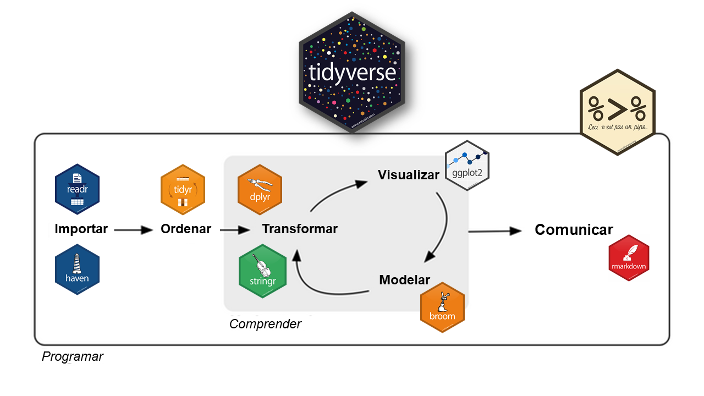

```{r xaringan-themer, include = FALSE}
#devtools::install_github("gadenbuie/xaringanthemer")
library(xaringanthemer)
library(tidyverse)

mono_light(
  base_color = "#1c5253",
  header_font_google = google_font("Modelica", "300", "300i"),
  text_font_google   = google_font("Modelica", "300", "300i"),
  code_font_google   = google_font("Modelica", "300", "300i"),
  text_color = "black",
  text_bold_color = TRUE,
  text_font_size = ".7cm",
  code_font_size = ".6cm"
  #text_font_size = 15
  )
```

```{r setup, include=FALSE}
knitr::opts_chunk$set(echo = TRUE, warning = F, message = F)
knitr::opts_chunk$set(fig.height = 6, out.width = "100%", comment = " ", cache = T, dpi = 300)
options(scipen = 9999)
options(max.print = 100)


source("https://raw.githubusercontent.com/EvaMaeRey/little_flipbooks_library/master/xaringan_reveal_parentheses_balanced.R")

base <- read.table(file = "../Fuentes/base_juguete_t3_16.txt", sep = "|")
```


class: middle, center

# ¿Qué es [Tidyverse](https://www.tidyverse.org/)?

---
class: middle, center

#### `Tidyverse` es una colección de paquetes de R, diseñados para la ciencia de datos. 
 
#### Todos los paquetes comparten una filosofía de diseño, gramática y estructuras de datos subyacentes.

---
class: center, middle

```{r echo=FALSE, out.width = '50%', fig.align = 'center'}

```

---
class: middle, center

## Caja de herramientas

* El objetivo principal de sus paquetes y funciones es la de proveer herramientas para facilitar las tareas típicas de la ciencia de datos:

```{r echo=FALSE, out.width = '80%', fig.align = 'center'}


```

  
---
class: middle, center

# ¿Por qué `tidyverse`?

---

### __¿Por qué tidyverse?__

<br><br>
<br>

- __Es más simple de leer y de escribir para seres humanos__

<br>

- __Sus paquetes y funciones tienen un esquema en común. Por ejemplo, el primer parámetro de cualquier función es siempre la base de datos -o data.frame-__

<br>

- __La comunidad, basada en los principios del codigo abierto y trabajo colaborativo__


---
### __Instalación y uso__

* Sólo una vez (por computadora):
```r
install.packages("tidyverse")
```

--

* En cada inicio de sesión de R o Rstudio:
```r
library(tidyverse)
```
 
--

_No es necesario esto:_

```r
install.packages("dplyr")
install.packages("tidyr")
install.packages("ggplot2")
```

---
class: middle, center, inverse
  
```{r echo=FALSE, out.width = '50%', fig.align = 'center'}
knitr::include_graphics("img/logo dplyr.png")
```

---
## Funciones del paquete dplyr:

<br>

| __Función__   | __Acción__ |
| :---          | ---:   |
| `select()`    | *selecciona o descarta variables*|
| `filter()`    | *selecciona filas*|
| `mutate()`    | *crea / edita variables*|
| `rename()`    | *renombra variables*|
| `group_by()`  | *segmenta en funcion de una variable*|
| `summarize()` | *genera una tabla de resúmen*|


---
class: middle, center

# __select()__
***
#### _Elije o descarta columnas de una base de datos_

---
class: middle, left

La función tiene el siguiente esquema:
```r 
select(base_de_datos,
    columna1, columna2, columna...x)
```
<br>

O, lo que es lo mismo:
```r
base_de_datos %>% 
    select(columna1, columna2, columna...x)
```
<br>

_Más adelante vamos a ver cómo funciona mejor el uso del ` %>% `_

---
## Ejemplo

Importamos una base de datos (ubicada en la carpeta `data` de la clase):
```{r}
base <- read.table(file = "../Fuentes/base_juguete_t3_16.txt", sep = "|")
```

--
<br>

Usamos la función `colnames()` para ver qué variables (columnas) contiene el objeto llamado `base`:
```{r}
colnames(base)
```

---

<br><br>
<br><br>

Supongamos que queremos trabajar sólo con las siguientes variables, según el diseño de registro de la EPH:

- `ANO4` --> _Año en el que se hizo la encuesta_

- `TRIMESTRE` --> _Trimestre en el que hizo la encuesta_

- `ESTADO` --> _Condición de actividad de la persona entrevistada (Ocupado / Desocupado / Inactivo)_

- `CAT_OCUP` --> _Categoría ocupacional de la persona entrevistada (Asalariado / Cuentrapropista / Patrón)_

---

```{r sel, eval = F, echo = F}
base %>%
  select(ANO4, TRIMESTRE, ESTADO, CAT_OCUP)
```

`r apply_reveal("sel")`

---
class: middle, center

## Otra forma de selecionar

---

```{r sel2, eval = F, echo = F}
base %>%
  select(2:6)
```

`r apply_reveal("sel2")`

---
class: middle, center

## Una más!

---

```{r sel3, eval = F, echo = F}
base %>%
  select(ANO4:AGLOMERADO)
```

`r apply_reveal("sel3")`

---
class: middle, center

## En la selección, también damos el orden de las columnas

---

```{r sel4, eval = F, echo = F}
base %>%
  select(CAT_OCUP, ESTADO, TRIMESTRE, ANO4)
```

`r apply_reveal("sel4")`

---
class: center, middle

# __PRÁCTICA__

---

class: middle, center

# __filter()__

***

#### _Filtra casos (filas) de una base de datos en función de una o más variables_

---
<br><br>
<br><br>

- En R base: 
```r
base_de_dato$variable[base_de_datos$variable == categoria]
```

--
<br>

- En `tidyverse`:
```r
base_de_datos %>% 
  filter(variable == categoria)
```

---
<br><br>
<br><br>

Supongamos que queremos quedarnos con la población que reside en `Bahía Blanca`:
 
Según el diseño de registro de la EPH, la variable se llama `AGLOMERADO` y el valor que corresponde a Bahía Blanca es el `3`. 

La sentencia quedaría de la siguiente manera:

---
```{r fil1, eval = F, echo = F}
base %>%
  select(TRIMESTRE, ANO4, AGLOMERADO) %>% 
  filter(AGLOMERADO == 3)
```

`r apply_reveal("fil1")`

---

<br><br>
<br><br>

#### Condiciones por las cuales filtrar:

.pull-left[

|Condición |Acción              |
| :---     | ---:               |
|          |                    |
| `==`     | *igual*            |
| `!=`     | *distinto*         |
| `>`      | *mayor que*        |
| `<`      | *menor que*        |
| `>=`     | *mayor o igual que*|
| `<=`     | *menor o igual que*|

]

.pull-right[

| Operador | Descripción |
| :---     | ---:               |
|          |                    |
| `&`      | *y* - Cuando se cumplen ambas condiciones   |
| &#124;   | *o* - Cuando se cumple una u otra condición   |


]

---
class: middle, 

Supongamos que queremos quedarnos sólo con aquella población que cumpla las siguientes condiciones:

- Se encuentre ocupada (`ESTADO == 1`);

- Viva en _La Plata_ (`AGLOMERADO == 2`) o en Santa Fé (`AGLOMERADO == 5`);

- Sea asalariada (`CAT_OCUP == 3`):

---
```{r fil2, rows.print=10, col.print=10, eval = F, echo = F}
base %>%
  select(TRIMESTRE, ANO4, AGLOMERADO, ESTADO, CAT_OCUP) %>% 
  filter(ESTADO == 1 & CAT_OCUP == 3) %>% 
  filter(AGLOMERADO == 2 | AGLOMERADO == 5)
```

`r apply_reveal("fil2")`

---
class: center, middle

# __PRÁCTICA__

---
class: middle, center

# __mutate()__

***

#### _Crea variables nuevas o reemplaza existentes_

---

<br><br>
<br><br>

- En R base: 
```r
base_de_dato$var_nueva <- base_de_datos$var_1 + base_de_datos$var_2
```
--
<br>

- En `tidyverse`:
```r
base_de_datos %>% 
   mutate(var_nueva = var_1 + var_2)
```

---
class: center, middle

Supongamos que queremos observar cuánto ganan las personas que tienen dos o más empleos. Para ello, vamos a crear una nueva variable que sume los montos de los ingresos que perciben las personas tanto por su ocupación principal (`P21`) como por otras ocupaciones (`TOT_P12`).

---
```{r mut1, rows.print=10, col.print=10, eval = F, echo = F}
base %>%
  select(ESTADO, CAT_OCUP, P21, TOT_P12) %>% 
  filter(ESTADO == 1) %>% 
  filter(P21 > 0 & TOT_P12 > 0) %>% 
  mutate(ingreso_tot = P21 + TOT_P12)
```

`r apply_reveal("mut1")`

---
class: center, middle

## Con `mutate()` también se puede editar una variable ya existente en la base de datos

---
```{r mut2, rows.print=10, col.print=10, eval = F, echo = F}
base %>%
  select(ESTADO, CAT_OCUP, P21, TOT_P12) %>% 
  filter(ESTADO == 1) %>% 
  mutate(ESTADO = case_when(ESTADO == 1 ~ "Ocupado/a",
                            ESTADO == 2 ~ "Desocupado/a",
                            ESTADO == 3 ~ "Inactivo/a",
                            ESTADO == 4 ~ "Menor de 10 años"))
```

`r apply_reveal("mut2")`

---
class: center, middle

# __PRÁCTICA__

---

class: middle, center

# __rename()__

***

#### _Asigna un nuevo nombre a variables existentes_

---

<br><br>
<br><br>

- En R base: 

```r
colnames(base_de_datos)[1] <- "nombre_nuevo"
```

<br> 

- En `tidyverse`:
```r
base_de_datos %>% 
   rename(var_nueva = var_vieja)
```

---
class: center, middle

```{r ren1, eval = F, echo = F}
base %>%
  select(ESTADO, CAT_OCUP, P21, TOT_P12) %>% 
  rename(cond_act = ESTADO) %>% 
  rename(categoria_ocupacional = CAT_OCUP,
         ingreso_oc_pr = P21,
         ingreso_otras_oc = TOT_P12)
```

`r apply_reveal("ren1")`

---
class: center, middle

# __PRÁCTICA__

---
class: middle, center

# __arrange()__

***

#### _Ordena los valores de una variable en base a un criterio_

---

<br><br>
<br><br>

Orden ascendente (por default)

```r
base_de_datos %>% 
   arrange(var1)
```
<br>

Orden descentende
```r
base_de_datos %>% 
   arrange(-var1)
```

---

```{r orden1, eval = F, echo = F}
base %>%
  select(ESTADO, CAT_OCUP, P21, TOT_P12) %>% 
  filter(P21 > 0) %>% 
  arrange(P21) %>% 
  arrange(-P21)
```

`r apply_reveal("orden1")`

---
class: center, middle

# __PRÁCTICA__

---
class: middle, center

# __summarise()__

***

#### _Resume la información en una nueva tabla_

---

<br><br>
<br><br>

```r
base_de_datos %>% 
        summarise(var1_resumen = sum(var1),
                  var2_media   = mean(var2),
                  var2_desvio  = sd(var2),
                  var2_cv      = var2_desvio / var2_media * 100)
```

---
```{r summarise1, eval = F, echo = F}
base %>%
  select(ESTADO, CAT_OCUP, CH04, P21) %>% 
  filter(P21 > 0) %>% 
  summarise(ingreso_medio  = mean(P21),
            ingreso_desvio = sd(P21),
            ingreso_cv     = ingreso_desvio / ingreso_medio * 100)
```

`r apply_reveal("summarise1")`


---
class: center, middle

# __PRÁCTICA__

---
class: middle, center

# __group_by()__

***

#### _Aplica una operación sobre la población de forma segmentada por alguna variable_

---

<br><br>
<br><br>

```r
base_de_datos %>% 
        group_by(var1)
```

---
class: center, middle

Queremos conocer el ingreso promedio de la población ocupada según su categoría ocupacional (si son asalariados, patrones o cuentapropistas)

---
```{r group1, eval = F, echo = F}
base %>%
  select(ESTADO, CAT_OCUP, CH04, P21) %>% 
  filter(ESTADO == 1 & P21 > 0) %>% 
  mutate(CAT_OCUP = case_when(CAT_OCUP == 1 ~ "Patrón",
                              CAT_OCUP == 2 ~ "Cuenta propia",
                              CAT_OCUP == 3 ~ "Asalariado")) %>% 
  group_by(CAT_OCUP) %>% 
  summarise(ingreso_medio  = mean(P21),
            ingreso_desvio = sd(P21),
            ingreso_cv     = ingreso_desvio / ingreso_medio * 100)
```

`r apply_reveal("group1")`

---
```{r group2, eval = F, echo = F}
base %>%
  select(ESTADO, CAT_OCUP, CH04, P21) %>% 
  filter(ESTADO == 1 & P21 > 0) %>% 
  mutate(CAT_OCUP = case_when(CAT_OCUP == 1 ~ "Patrón",
                              CAT_OCUP == 2 ~ "Cuenta propia",
                              CAT_OCUP == 3 ~ "Asalariado"),
         CH04     = case_when(CH04 == 1 ~ "Varón",
                              CH04 == 2 ~ "Mujer")) %>%
  group_by(CAT_OCUP, CH04) %>% 
  summarise(ingreso_medio  = mean(P21),
            ingreso_desvio = sd(P21),
            ingreso_cv     = ingreso_desvio / ingreso_medio * 100)
```

`r apply_reveal("group2")`

---
class: middle, center, inverse
  
```{r echo=FALSE, out.width = '50%', fig.align = 'center'}
knitr::include_graphics("img/logo tidyr.png")
```

---
class: center, middle

# __PRÁCTICA__

---
## Funciones del paquete tidyr:

<br>

| __Función__      | __Acción__ |
| :---             | ---:       |
| `pivot_longer()` | *Apila en una columna los valores de varias*|
| `pivot_wider()`   | *Separa en varias columnas los valores de una sola*|


---
class: middle, center

# __pivot_longer()__
***
#### _Reestructura la base, apilando en una columna a varias de ellas y con sus respectivos valores_


---

```{r pivot_l, eval = F, echo = F}
base %>%
  select(ESTADO, CAT_OCUP, CH04, P21) %>% 
  filter(ESTADO == 1 & P21 > 0) %>% 
  mutate(CAT_OCUP = case_when(CAT_OCUP == 1 ~ "Patrón",
                              CAT_OCUP == 2 ~ "Cuenta propia",
                              CAT_OCUP == 3 ~ "Asalariado"),
         CH04     = case_when(CH04 == 1 ~ "Varón",
                              CH04 == 2 ~ "Mujer")) %>%
  group_by(CAT_OCUP, CH04) %>% 
  summarise(ingreso_medio  = mean(P21),
            ingreso_desvio = sd(P21),
            ingreso_cv     = ingreso_desvio / ingreso_medio * 100) %>% 
  pivot_longer(cols = c("ingreso_medio", "ingreso_desvio", "ingreso_cv"), 
               names_to = "Indicador", values_to = "Valor")


```

`r apply_reveal("pivot_l")`

---
class: middle, center

# __pivot_wider()__
***
#### _Reestructura la base, apilando en varias columnas a una de ellas por cada categoría de la misma_

---

```{r pivot_2, eval = F, echo = F}
base %>%
  select(ESTADO, CAT_OCUP, CH04, P21) %>% 
  filter(ESTADO == 1 & P21 > 0) %>% 
  mutate(CAT_OCUP = case_when(CAT_OCUP == 1 ~ "Patrón",
                              CAT_OCUP == 2 ~ "Cuenta propia",
                              CAT_OCUP == 3 ~ "Asalariado"),
         CH04     = case_when(CH04 == 1 ~ "Varón",
                              CH04 == 2 ~ "Mujer")) %>%
  group_by(CAT_OCUP, CH04) %>% 
  summarise(ingreso_medio  = mean(P21),
            ingreso_desvio = sd(P21),
            ingreso_cv     = ingreso_desvio / ingreso_medio * 100) %>% 
  pivot_longer(cols = c("ingreso_medio", "ingreso_desvio", "ingreso_cv"), 
               names_to = "Indicador", values_to = "Valor") %>% 
  pivot_wider(names_from = "Indicador", values_from = "Valor")
```

`r apply_reveal("pivot_2")`

---

class: center, middle

# __¡Manos a la obra!__

```{css, eval = TRUE, echo = F}
.remark-code{line-weight: 8; font-size: 75%}
```