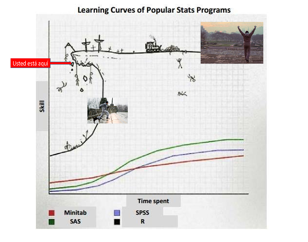

```{r setup, include=FALSE}
knitr::opts_chunk$set(echo = TRUE, warning = F, message = F)
knitr::opts_chunk$set(fig.height = 6, out.width = "100%", comment = " ", cache = T, dpi = 300)
try(source("https://raw.githubusercontent.com/EvaMaeRey/little_flipbooks_library/master/xaringan_reveal_parentheses_balanced.R"))
try(source("../flipbooks/xaringan_reveal_parentheses_balanced.R"))

options(scipen = 9999)
```


```{r xaringan-themer, include = FALSE, eval = F}
xaringanthemer::mono_accent(
  base_color = "#43418A",
  header_font_google = xaringanthemer::google_font("Montserrat"),
  text_font_google   = xaringanthemer::google_font("Montserrat", "200", "200i"),
  code_font_google   = xaringanthemer::google_font("Droid Mono"),
  text_font_size = ".7cm",
  code_font_size = ".7cm")

library(quantreg)
```

# Repasando

<br>

- Empezamos a ver los fundamentos del lenguaje R.

<br>

- Incorporamos la forma de trabajo a través de objetos.

<br>

- Empezamos a importar bases de datos, a procesar la información que hay dentro de ellas

<br>

- Conocimos algunas funciones para transformar sus elementos (variables, categorías, filas, columnas)

---

### Llegamos a un punto importantísimo del curso


```{r echo=FALSE, out.width = '70%', fig.align = 'center'}

```

---
class: middle, center, inverse

# Visualización de datos - Paquete ggplot2

---

### ¿Por qué visualizar?

<br> 

- _"La visualización es el proceso de hacer visibles los contrastes, ritmos y eventos que los datos expresan, que no podemos percibir cuando vienen en forma de áridas listas de números y categorías."_ [^1]

<br>
  
- Interpretar / decodificar la información de forma visual

<br>


[^1]: https://bitsandbricks.github.io/ciencia_de_datos_gente_sociable/visualizacion.html

---
### El paquete ggplot2

<br>

--

- _ggplot2_ es uno de los paquetes principales de _tidyverse_

<br>

--

- Tiene la misma lógica de "capas" y de apilamiento de sentencias, como venimos haciendo con el comando __%>%__, pero ahora lo haremos con el símbolo __+__

--

- Necesitamos estructurar los datos de forma "vertical" (¿pivot_longer suena familiar?), es decir, una columna por cada dimensión (variable) y una fila por cada observación. Estructurar bien los datos ahorra muchos dolores de cabeza.

  
---
### Manos a la obra

<br>

Queremos analizar de forma descriptiva una o más variables. Intentemos con las herramientas que aprendimos hasta el momento.
  
<br>

--

Si queremos, por ejemplo, ver cómo se comporta el ingreso de la población, podemos empezar con el __ingreso de la ocupación princial__ de los individuos.
  
  
Busquemos la variable en el diseño de registro:

```{r echo=FALSE, out.width = '80%', fig.align = 'center'}
knitr::include_graphics("img/dis_reg_p21.png")
```

---
### Librerías

<br>

* Cargamos las librerías necesarias 

```{r libreria, echo=TRUE, warning=FALSE}
library(tidyverse)
library(questionr) # funciones para facilitar trabajo con encuestas
library(eph)
library(ggthemes)  # funciones para tunear gráficos
library(GGally)
```

<br>

* Descargamos una base de la EPH del año 2018 con la función del paquete _eph_
```{r}
base <- get_microdata(year = 2018,
                      trimester = 1,
                      type = "individual") 
```

---

## El primer paso antes de hacer un gráfico es saber qué quiero mostrar y con qué tipo de datos cuento

--

### Analicemos la variable:

--

```{r echo=TRUE}
class(base$P21)
```

--

```{r echo=TRUE}
any(is.na(base$P21))
```

--
```{r echo=TRUE}
summary(base$P21)
```

---

## Ahora sí, intentemos graficarlo

---

```{r g1, eval = F, echo = F}
ggplot(data = base) +
  aes(x = P21, 
      weights = PONDIIO) +
  geom_histogram()
```


`r apply_reveal("g1")`


---
### Saquemos los valores extremos, para poder analizar mejor gráficamente el resto de la distribución.

<br>

```{r echo=TRUE}
base <- base %>% 
  filter(P21 > 0 & P21 < 50000)
```

--

<br>

Tiramos el summary nuevamente
```{r echo=TRUE}
summary(base$P21)
```

---

```{r g2, eval = F, echo = F, warning=F}
ggplot(data = base) +
  aes(x = P21, 
      weights = PONDIIO) +
  geom_histogram(fill = "salmon", 
                 color = "grey")
```


`r apply_reveal("g2")`


---
## Gráficos de Boxplot

### ¿Y si la distribución del ingreso se comporta de manera diferente en función de otra variable?

- Probemos con otro tipo de gráfico que nos deje comparar, en este caso, para los distintos niveles educativos alcanzados

En el diseño de registro esta variable la encontramos como __NIVEL_ED__
```{r echo=FALSE, out.width = '80%', fig.align = 'center'}
knitr::include_graphics("img/dis_reg_nivel_ed.png")
```

---

```{r boxplot, eval = F, echo = F}
ggplot(data = base) +
  aes(x = NIVEL_ED) + 
  aes(y = P21) +
  geom_boxplot() +
  aes(group = NIVEL_ED)
```


`r apply_reveal("boxplot")`


---

## Mucho mejor! Pero... ¿Qué pasó con las categorías? ¿Cómo las muestro?

--

- Tal como se descarga la base de la página del INDEC, vemos que la variable __NIVEL_ED__ es de tipo "entero".

```{r echo=TRUE}
class(base$NIVEL_ED)
```

--

```{r echo=TRUE}
table(base$NIVEL_ED)
```

--

Transformemos, entonces, a _NIVEL_ED_ en una variable de tipo _factor_, asi podremos contar con las etiquetas e, incluso, reordenar sus categorías de forma ordinal
  
---

```{r echo=TRUE}
base <- base %>% 
  mutate(NIVEL_ED = factor(NIVEL_ED,
                           levels = c(7,1:6),
                           labels = c("Sin instruccion", "Primaria incompleta", "Primaria completa",
                                      "Secundaria incompleta", "Secundaria completa",
                                      "Sup. incompleto", "Sup. completo")))
```

Tiramos una frecuencia para chequear el trabajo hecho
```{r echo=TRUE}
table(base$NIVEL_ED)
```

---
## Gráficos de Boxplot

### Ahora sí, con etiquetas en la variable, sumemos otros parámetros del gráfico

---


```{r g3, eval = F, echo = F}
ggplot(data = base) +
  aes(x = NIVEL_ED) +
  aes(y = P21) +
  geom_boxplot() +
  aes(group = NIVEL_ED) +
  aes(fill = NIVEL_ED) +
  theme_minimal() +
  labs(x = "Máximo nivel educativo alcanzado") +
  labs(y = "Ingreso de la ocupación principal") +
  labs(title = "Boxplot del Ingreso de la Ocupación Principal por máximo nivel de estudios alcanzado") +
  labs(caption = "Fuente: Elaboración propia en base a EPH-INDEC") +
  scale_y_continuous(limits = c(0, 50000)) +
  coord_flip()
```


`r apply_reveal("g3")`


---
class: middle, center, inverse

## Gráficos de densidad

### Probemos con otro tipo de gráfico, que ayude a comparar mejor (que es nuestro objetivo)

---


```{r g4, eval = F, echo = F}
ggplot(data = base) +
  aes(x = P21,weights = PONDIIO) +
  geom_density() +
  aes(group = NIVEL_ED) +
  aes(color = NIVEL_ED) +
  theme_minimal() +
  labs(x = "Ingreso de la ocupación principal") +
  labs(title = "Ingreso de la Ocupación Principal por máximo nivel de estudios alcanzado") +
  labs(caption = "Fuente: Elaboración propia en base a EPH-INDEC")
```


`r apply_reveal("g4")`


---
class: middle, center, inverse

## Gráficos de densidad

### Que hacemos si queremos comparar las distribuciones del ingreso por sexo, contemplando el nivel educativo como variable diferenciadora
  
---

Nuevamente, tenemos que editar primero una variable para poder trabajar con etiquetas. En este caso la variable de sexo:

```{r echo=TRUE}
base <- base %>% 
  mutate(CH04 = factor(CH04,
                       levels = c(1, 2),
                       labels = c("Varón", "Mujer")))
table(base$CH04)
```

---

```{r g5, eval = F, echo = F}
ggplot(data = base) +
  aes(x = P21) +
  geom_density() +
  aes(group = CH04) +
  aes(color = CH04) +
  theme_minimal() +
  labs(x = "Ingreso de la ocupación principal") +
  labs(title = "Ingreso de la Ocupación Principal por Nivel educativo") +
  labs(caption = "Fuente: Elaboración propia en base a EPH-INDEC") +
  facet_wrap(~ NIVEL_ED) +
  scale_x_continuous(limits = c(0, 50000))
```


`r apply_reveal("g5")`


---
class: middle, center, inverse

## Gráficos de Barras

### Ahora queremos conocer cómo se distribuye la población en función del máximo nivel educativo alcanzado

---

- Observemos un poco más sobre la variable con las herramientas que conocemos
```{r echo=TRUE}
base %>% 
  calculate_tabulates(x = "NIVEL_ED",
                      add.totals = "row",
                      add.percentage = "col",
                      weights = "PONDERA")
```

---

¿Y si la cruzamos por sexo?

```{r echo=TRUE}
base %>% 
  calculate_tabulates(x = "NIVEL_ED",
                      y = "CH04",
                      add.totals = "row",
                      add.percentage = "col",
                      weights = "PONDERA")
```

---

```{r, include=FALSE}
base_graf <- base %>%
  select(NIVEL_ED, CH04, PONDERA) %>% 
  group_by(NIVEL_ED) %>%
  summarise(pob_tot = sum(PONDERA),
            pob_varon   = sum(PONDERA[CH04 == "Varón"]),
            pob_mujer   = sum(PONDERA[CH04 == "Mujer"]),
            varon = pob_varon/pob_tot * 100,
            mujer = pob_mujer/pob_tot * 100) %>%
  select(NIVEL_ED, mujer, varon) %>%
  gather(key = sexo, value = valor, 2:3)
```

```{r g_bar1, eval = F, echo = F}
base %>%
  select(NIVEL_ED, CH04, PONDERA) %>% 
  group_by(NIVEL_ED) %>%
  summarise(pob_tot = sum(PONDERA),
            pob_varon   = sum(PONDERA[CH04 == "Varón"]),
            pob_mujer   = sum(PONDERA[CH04 == "Mujer"]),
            varon = pob_varon/pob_tot * 100,
            mujer = pob_mujer/pob_tot * 100) %>%
  select(NIVEL_ED, mujer, varon) %>%
  gather(key = sexo, value = valor, 2:3)
```


`r apply_reveal("g_bar1")`


---

```{r echo=TRUE, out.width = '55%', fig.align = 'center'}
ggplot(data = base_graf) +
  aes(x = NIVEL_ED, y = valor, fill = sexo) +
  geom_bar(stat = "identity")+
  coord_flip()
```

---

```{r echo=TRUE, out.width = '55%', fig.align = 'center'}
ggplot(data = base_graf) +
  aes(x = NIVEL_ED, y = valor, fill = sexo) +
  geom_bar(stat = "identity",
           position = position_dodge())+
  coord_flip()
```

---

```{r echo=TRUE, out.width = '55%', fig.align = 'center'}
ggplot(data = base_graf) +
  aes(x = NIVEL_ED, y = valor, fill = sexo) +
  geom_bar(stat = "identity",
           position = position_dodge(),
           color = "black")+
  coord_flip()
```

---

```{r echo = TRUE, out.width = '40%', fig.align = 'center'}
ggplot(data = base_graf) +
  aes(x = NIVEL_ED, y = valor, fill = sexo) +
  geom_bar(stat = "identity",
           position = position_dodge(),
           color = "black") +
  labs(title = "Máximo nivel de intrucción alcanzado por sexo",
       x = "Máximo nivel de instrucción alcanzado",
       y = "Porcentaje",
       caption = "Fuente: EPH - INDEC. Total Aglomerados, 1 trimestre de 2018.") +
  coord_flip()
```

---
class: middle, center, inverse

## Gráficos de líneas

### Veamos la evolución en el tiempo del ingreso promedio de la ocupación principal

---

* Descarguemos las 4 bases de datos del año 2018 con la función del paquete _eph_. Que tiene el objeto que nos trae la función *get_microdata*? 

```{r base, echo=TRUE, warning=FALSE}
bases2018 <- get_microdata(year = 2018,
                      trimester = 1:4,
                      type = "individual") 

bases2018 
```
--

El objeto es un _tibble_ de cuatro observaciones, y 5 variables. En la quinta variable están contenidos los dataframes propios a cada trimestre

---

* Seleccionamos unicamente la columna *microdata* y aplicamos la funcion **unnest** para apilar todos los dataframes en uno solo.

```{r}
bases2018.apiladas <- bases2018 %>%
    select(microdata) %>%
    unnest(cols = c(microdata))

nrow(bases2018.apiladas)
```
--
Tenemos un objeto con más de 230.000 registros! 

---

* Calculemos el ingreso de la ocupación principal promedio por sexo en cada trimestre

```{r data.ingresos, echo = F,warning=F}

base.ingresos.prom <- bases2018.apiladas %>% 
  filter(P21>0) %>% 
  mutate(CH04 = factor(CH04,levels = c(1, 2),labels = c("Varón", "Mujer"))) %>%
  group_by(ANO4,TRIMESTRE,CH04) %>% 
  summarise(ingreso.promedio=weighted.mean(P21,PONDIIO)) 

base.ingresos.prom
```

`r apply_reveal("data.ingresos")`

---

```{r g6, eval = F,echo = F}
base.ingresos.prom %>% 
ggplot() +
  aes(x = TRIMESTRE,
      y = ingreso.promedio,
      group = CH04,
      color = CH04) +
  geom_line() +
  geom_point() +
  theme_minimal() +
  labs(x = "Trimestre") +
  labs(y = "Ingreso de la ocupación principal") +
  labs(title = "Ingreso de la Ocupación Principal promedio por Sexo. Año 2018") +
  labs(caption = "Fuente: Elaboración propia en base a EPH-INDEC") 
```

`r apply_reveal("g6")`

---

* Como se relaciona la variable *P21* con el resto de variables de la base? La función **ggpairs** del paquete *GGaly nos permite una mirada rápida de la interacción entre las variables de nuestra base (seleccionamos algunas)

```{r g7, eval = F,warning=FALSE,message=F}
base %>% 
  select(P21,EDAD = CH06,SEXO = CH04,NIVEL_ED) %>% 
ggpairs(mapping = aes(color = SEXO))+
  theme(axis.text.x = element_text(angle = 45))
```

`r apply_reveal("g7")`
