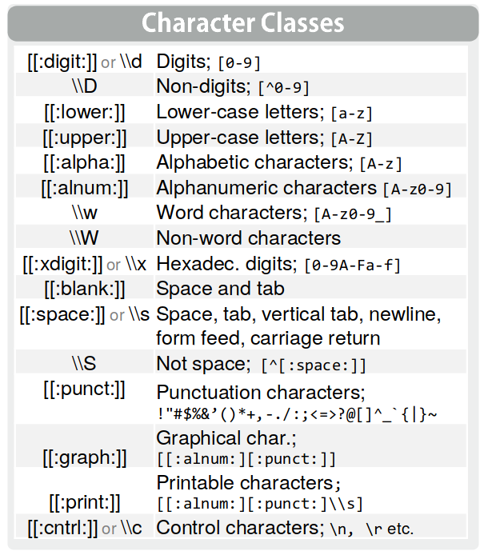

[^1]
```{r setup, message = FALSE,echo=FALSE}
knitr::opts_chunk$set(echo = TRUE,message = FALSE)

```

```{r,message=FALSE}
 #install.packages("rtweet")
library(rtweet) # descargar info de twitter
library(tidyverse)
library(wordcloud2)
library(tm) # para trabajar con corpus de textos
library(stringr) #para trabajar con strings
library(RVerbalExpressions) #para trabajar expresiones regulares 
library(lubridate) #para trabajar con fechas 
```

# Introducción

- Junto con las imágenes y los audios, los textos son una fuente de datos no estructurados que se multiplicó en los últimos años.

- Para poder hacer uso de la información que contienen es necesario procesar las fuentes originales para alcanzar un formato estandarizado que nos permita tomar métricas o diseñar modelos para analizar dicha información.

- En esta clase veremos una introducción a los comandos necesarios para tomar un corpus de texto, "limpiarlo" y generar un Bag of Words (Bolsa de palabras). Luego visualizaremos de forma sencilla la información


#rtweet
El paquete [__rtweet__](https://rtweet.info/) tiene un montón de funcionalidades para acceder a información de twitter (aunque de forma limitada sin poner el billete). 

Concentrémosnos en la función **search_tweets**. Esta nos permite descargar data de los últimos 6 a 9 días específicando un texto clave de busqueda. El límite permitido por tweeter es de 18 mil registros, pero la función tiene un parametro para realizar una iteraración y acceder a mayor cantidad de casos. 

Para  poder acceder a la información primero debemos crear un [_token__](https://rtweet.info/articles/auth.html) de usuario.
```{r}
# chusmeen la cantidad de especificaciones que se le pueden dar a la funcion search_tweets

#?search_tweets 

 # villa_azul_tweets <- search_tweets(q = '"villa azul"',
 #                                    n = 18000, 
 #                                    include_rts = FALSE,
 #                                    lang ="es")

# saveRDS(villa_azul_tweets,'data/villa_azul_tweets.RDS')

villa_azul_tweets<- readRDS('data/villa_azul_tweets.RDS')
```

El dataframe tiene 90 variables, veamos que pinta tienen los datos seleccionando algunas de las principales.
```{r}
villa_azul_tweets_select <- villa_azul_tweets %>% 
  select(text,name,screen_name,created_at,location,
         favorite_count,retweet_count)

head(villa_azul_tweets_select)
```
Aparecen muchas cosas que vamos a querer descartar para armar nuestra bolsa de palabras:  

- Links a paginas web
- Caracteres especiales ("",?,#)
- Imagenes (2do tweet de arriba)


Antes de pasar a operarar "limpiando"  el conjunto de tweets que descargamos, veamos ejemplitos sencillos sobre como detectar ciertos patrones en texto con el paquete **stringr**

#Expresiones regulares

Un elemento fundamental para la manipulación del texto son las [expresiones regulares](https://stringr.tidyverse.org/articles/regular-expressions.html). Éstas sirven para captar _patrones_ que aparecen en el texto y luego operar sobre ellos (extraerlos, reemplazarlos, detectarlos, etc.)

{width=1000}


## Principales funciones

### str_length

Con la función `str_length()` podemos ver el largo de un string.
```{r}
string1 <- "cuarenteNA"
str_length(string1)
```

Ojo que cuenta los espacios en blanco como un caracter.
```{r}
string2 <- "cuarentena 2020"
str_length(string2)
```

### str_sub

La función `str_sub()` nos permite extraer los caracteres que se encuentran entre determinadas posiciones. Tiene tres argumentos: el string, el orden del caracter a partir del cual tiene que empezar a extraer y el orden del caracter hasta el cual tiene que extraer.

```{r}
#quiero el tercer caracter
str_sub(string1,3,3)
```

```{r}
#quiero del cuarto al sexto
str_sub(string1,4,6)
```

Puedo pasarle la posición de los caracteres con un menos para indicar que quiero que cuente de atrás para adelante. Por ejemplo, si quiero que traiga el anteúltimo caracter llamo a la posición como `-2`.

```{r}
#quiero la última y anteúltima posición
str_sub(string1,-2,-1)
```

Otro uso que le podemos dar a este comando es el de reemplazar elementos. Supongamos que quiero reemplazar la última letra por una z.
```{r}
str_sub(string2,-1,-1) <- "1?"
string2
```

### str_trim
Función para el manejo de espacios en blanco.

Es frecuente que aparezcan datos mal cargados o con errores de tipeo que tienen espacios donde no debería haberlos. La función `str_trim()` permite que nos deshagamos de los espacios en blanco a izquierda, derecha o ambos lados de nuestro string.

```{r}
string3 <- c(" cuarentena   ", "en   ",  "   argentina")
#Veamos el string
string3
```
Quitamos los espacios en blanco a ambos lados con el argumento side='both'

```{r}
str_trim(string3, side = 'both')
```

Quitamos los espacios en blanco del lado izquierdo con el argumento side='left'
```{r}
str_trim(string3, "left")
```

### Mayúsculas y minúsculas

Existen varias funciones para manipular las mayusculas/minúsculas de nuestros strings. A modo de sugerencia, siempre es convientiente manejarse con todos los caracteres en minúscula o en mayúscula. Esto ayuda a normalizar la información para armar mejor grupos, joinear tablas, etc.

```{r}
string1
```
```{r}
#llevo todo a minúsculas
str_to_lower(string1)
```
```{r}
#llevo todo a mayúsculas
str_to_upper(string1)
```
```{r}
#llevo a mayúscula la primer letra de cada palabra
str_to_title("cuarentena en argentina")
```

### str_split

La función `str_split()` nos permite partir un string de acuerdo a algún separador/patron (pattern) que definamos.

```{r}
#quiero separar todas las letras de mi string
string1_separado <- str_split(string1,pattern = "")
string1_separado
```

Notemos que esta funcion nos devuelve una lista

```{r}
class(string1_separado)
# Si queremos acceder al primer elemento de la lista
string1_separado[[1]][1]
```

Definimos un nuevo string

```{r}
string5 <- "cuarentena-argentina-2020"
string5
```

Lo separamos por el guion

```{r}
str_split(string5,pattern="-")
```

### str_replace
Las funciones `str_replace()` y `str_replace_all()` de `stringr` nos permiten encontrar un patrón dentro de nuestro string y reemplazarlo por otro. 

`str_replace` solo reemplaza la primera ocurrencia del patron mientras que `str_replace_all()` reemplaza todas las ocurrencias

```{r}
string6 <- "Casi 10 millones de personas recibieron el #IFE durante la #Cuarentena en Argentina"
string6
```
Veamos la diferencia de ambas funciones

```{r}
# Reemplazamos la primera ocurrencia
str_replace(string = string6, pattern = "#", replacement = "")
# Reemplazamos todas las ocurrencias
str_replace_all(string = string6, pattern = "#", replacement = "")
```

### str_detect

La función `str_detect()` nos permite encontrar expresiones dentro de nuestros strings. Nos reporta `VERDADERO` o `FALSO` de acuerdo a si encuentra la expresión que estamos buscando.

```{r}
string4<- c("año","2020","extraño")
un_texto <- 'que año extraño el 2020. como quisiera salir a tomar una cerveza. paciencia'

str_detect(string4, "2020")
str_detect(un_texto,'2020')
```

¿Qué pasa cuando queremos identificar patrones un poco más complejos a la hora de limpiar nuestros datos?

Para ello podemos generar una expresión regular a través de distintos elementos:

## Caracteres especiales.

Son formas de referirnos de forma general a ciertos tipos de caracteres

{width=300}

por ejemplo
```{r}
un_texto
```


```{r}
str_detect(un_texto, '[[:punct:]]')#Hay puntuación en mi string?
str_detect(un_texto, '[[:alnum:]]')#Hay numeros en mi string?
str_detect(un_texto, '[[:upper:]]')#Hay mayusc en mi string?
```

**Importante**: Hay muchas pero muchas formas más de identificar expresiones regulares y trabajaro con los strings. Nos acotamos acá a las más frecuentes.


Vamos a retomar nuestro ejemplo inicial de los tweets.     

## Normalización

Para construir el Bag of Words se debe considerar los siguientes procesos:

- __Tokenization__: Es el proceso de partir un string de texto en palabras y signos de puntuación.
 
- __Eliminar puntuación__. Nos referimos acá a todo tipo de caracteres especiales indeseados       

- __Stop Words__: remover las palabras más comunes del idioma (“el”, “la”, “los”, “de”) ya que aparecen en todos los textos y no aportan información valiosa para distinguirlos.

- __Lemmatization__: Es la representación de todas las formas flexionadas (plural, femenino, conjugado, etc.). Para esto, es necesario contar con una base de datos léxica. Para esto podemos usar [koRpus](https://github.com/unDocUMeantIt/koRpus) que incluye el lexicón TreeTagger.

- __Stemming__: Es similar a la lematización, pero no se basa en las estructuras lexicales, sino que realiza una aproximación, quedándose con las primeras letras de la palabra. 

- __N-gramas__: A veces los conceptos que permiten distinguir entre documentos se componen de más de una palabra, por ejemplo:
  - “a duras penas” (trigrama),
  - “Buenos Aires” (bigrama) 
  - Las expresiones idiomáticas o los nombres propios cambian radicalmente de sentido si se separan sus componentes. 
  - Imaginense si quisiéramos clasificar la posición política de izquierda a derecha de los “Nacional Socialistas”!

__Ejemplo__: Limpiemos el texto de algunos casos complicados. Aquí nos vamos a concentrar simplemente en los primeros tres puntos mencionados de la normalización.

```{r}
primer.caso <- villa_azul_tweets_select$text[1]
primer.caso
```

La librería de **RVerbalExpressions** nos permite crear secuencialmente con formato tidy una expresión regular para buscar en nuestros strings. Si queremos borrar las menciones, en este caso necesitamos construir una expresion que encuentre un texto iniciado en "@" e identifique todos los caracteres que le sigan hasta que aparezca un espacio.
```{r}
menciones <- rx() %>% 
  rx_find('@')%>% 
  rx_anything_but(value = ' ')

menciones
```


```{r}
primer.caso<- str_remove_all(primer.caso, pattern = menciones)
primer.caso
```

Saquemos todo lo que no sea un caracter alfa-numérico o un espacio en blanco
```{r}
str_remove_all(primer.caso, pattern = "[^[:alnum:][:blank:]]")
```
**Pregunta**: ¿No podría haber directo eliminado todo lo que sea alfanumérico para sacar las menciones, hashtags, etc? 

Tenemos algo más acorde a lo que necesitamos.

Vamos con otro ejemplo díficl
```{r}
caso.28 <- villa_azul_tweets_select$text[28]
caso.28
```

También tenemos entre los tweets links a paginas web. En este caso necesitamos borrar todos los caracteres que sigan a un "http", hasta que aparezca un espacio.
```{r}
expresion <- rx() %>% 
  rx_find('http') %>% 
 # rx_maybe('s') %>% 
 # rx_maybe('://') %>% 
  rx_anything_but(value = ' ')

expresion

```

```{r}
caso.28<- str_remove_all(caso.28, pattern = expresion)
caso.28
```
Armo una expresión para eliminar hashtags
```{r echo=TRUE}
hasthags <- rx() %>% 
  rx_find('#')%>% 
  rx_anything_but(value = ' ')

caso.28<- str_remove_all(caso.28, pattern = hasthags)
caso.28<- str_remove_all(caso.28, pattern = "[^[:alnum:][:blank:]]")
caso.28
```